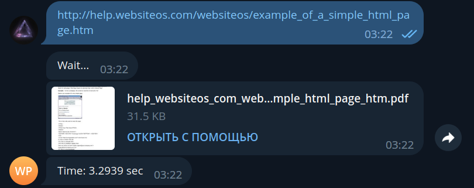
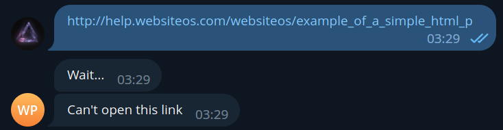

# webpage-to-pdf-telegram-bot
Telegram-bot for converting webpage urls to PDF.
# Tests
`master`:
[](https://github.com/Relfick/webpage-to-pdf-telegram-bot/actions/workflows/test-pipeline.yml)

`develop`:
[](https://github.com/Relfick/webpage-to-pdf-telegram-bot/actions/workflows/test-pipeline.yml)
# Run
#### 1. Clone repo
```
git clone https://github.com/Relfick/webpage-to-pdf-telegram-bot.git
```
#### 2. Go to project folder
```
cd webpage-to-pdf-telegram-bot
```
#### 3. Build image
```
docker build -t bot_app .
```
#### 4. Run
```
docker run bot_app
```

# Examples

#### 1. Greeting

#### 2. Correct url
Link: http://help.websiteos.com/websiteos/example_of_a_simple_html_page.htm

#### 3. Url doesn't exist
Link: http://help.websiteos.com/websiteos/example_of_a_simple_html_p


#### 4. Not a link
